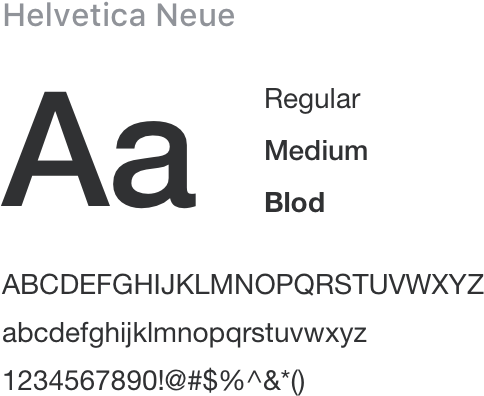

<!--
 * @Description: 字体
 * @Version: 2.0
 * @Autor: wuwei3
 * @Date: 2020-05-08 20:29:45
 * @LastEditors: Please set LastEditors
 * @LastEditTime: 2021-04-08 13:53:53
 -->

## Typography 字体

:::demo

```html
<template>
  <div class="b-font">
    
    
    
    
  </div>
</template>
<script>
  export default {
    data() {
      return {
        font_size_extra_large: "20px",
        font_size_large: "18px",
        font_size_medium: "16px",
        font_size_base: "14px",
        font_size_small: "13px",
        font_size_extra_small: "12px",
      };
    },
  };
</script>
<table class="demo-typo-size">
  <tbody>
    <tr>
      <td>层级</td>
      <td>字体大小</td>
      <td class="color-dark-light">举例</td>
    </tr>
    <tr :style="{ fontSize: font_size_extra_small }">
      <td>辅助文字</td>
      <td class="color-dark-light">{{font_size_extra_small}} Extra Small</td>
      <td>用 Biims-UI 快速搭建页面</td>
    </tr>
    <tr :style="{ fontSize: font_size_small }">
      <td>正文（小）</td>
      <td class="color-dark-light">{{font_size_small}} Small</td>
      <td>用 Biims-UI 快速搭建页面</td>
    </tr>
    <tr :style="{ fontSize: font_size_base }">
      <td>正文</td>
      <td class="color-dark-light">{{font_size_base}} Base</td>
      <td>用 Biims-UI 快速搭建页面</td>
    </tr>
    <tr :style="{ fontSize: font_size_medium }">
      <td>小标题</td>
      <td class="color-dark-light">{{font_size_medium}} Medium</td>
      <td>用 Biims-UI 快速搭建页面</td>
    </tr>
    <tr :style="{ fontSize: font_size_large }">
      <td>标题</td>
      <td class="color-dark-light">{{font_size_large}} large</td>
      <td>用 Biims-UI 快速搭建页面</td>
    </tr>
    <tr :style="{ fontSize: font_size_extra_large }">
      <td>主标题</td>
      <td class="color-dark-light">{{font_size_extra_large}} Extra large</td>
      <td>用 Biims-UI 快速搭建页面</td>
    </tr>
  </tbody>
</table>
```
